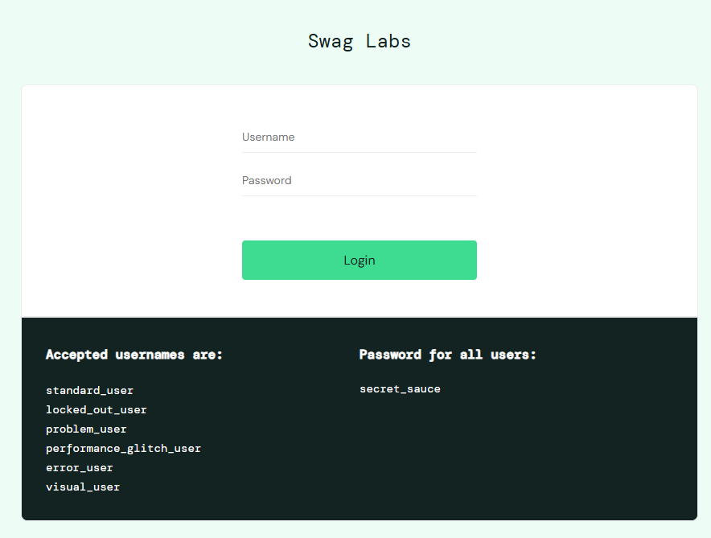

# SauceDemo — автоматизация тестирования

<p align="center">
  
</p>

## Описание проекта

Данный проект посвящён тестированию веб-приложения [saucedemo.com](https://www.saucedemo.com).  
Цель — проверить основные пользовательские сценарии и подготовить основу для UI-автоматизации на Java.

## Основные страницы приложения

В приложении выделяются 6 основных страниц:

- `LoginPage` — авторизация.
- `ProductsPage` — каталог товаров.
- `CartPage` — корзина.
- `CheckoutInfoPage` — ввод данных покупателя.
- `CheckoutOverviewPage` — подтверждение заказа.
- `CheckoutCompletePage` — успешное завершение заказа.

---

## Чек-лист проверок

### 1. LoginTest — страница авторизации

Страница входа в систему. Содержит поля для ввода имени пользователя и пароля, а также кнопку входа.

**Чек-лист:**

- `checkLoginWithPositiveCred()` — Успешный вход с валидными данными.
- `checkLoginWithEmptyPassword()` — Отображается ошибка при пустом поле `Password`.
- `checkLoginWithEmptyUser()` — Отображается ошибка при пустом поле `Username`.
- `checkLoginWithNegativeCred()` — Отображается ошибка при неверных данных.

---

### 2. ProductsTest — страница товаров

Главная страница после авторизации. Отображает список доступных товаров с названием, ценой, изображением и кнопкой
добавления в корзину.

**Чек-лист:**

- `productsListDisplayed()` — Отображается список товаров.
- `addToCartButtonAddsProduct()` — Кнопка `Add to cart` добавляет товар в корзину.
- `productSortingWorks()` — Сортировка товаров работает корректно.

---

### 3. CartTest — страница корзины

Страница с выбранными товарами. Отображает список добавленных товаров и позволяет перейти к оформлению заказа или
продолжить покупки.

**Чек-лист:**

- `addedProductDisplayedInCart()` — Добавленный товар отображается в корзине.
- `removeFromCartWorks()` — Удаление товара из корзины работает корректно.
- `cartPriceMatchesCatalogPrice()` — Цена товара в корзине совпадает с ценой в каталоге.
- `backToCatalogWorks()` — Переход назад в каталог работает корректно.

---

### 4. CheckoutInfoTest — страница информации о покупателе

Страница оформления заказа. Содержит форму для ввода персональных данных: `First Name`, `Last Name`, `Zip/Postal Code`.

**Чек-лист:**

- `checkoutFormOpens()` — Форма оформления заказа открывается.
- `checkoutFormFieldsDisplayed()` — Поля `First Name`, `Last Name`, `Zip/Postal Code` отображаются.
- `checkoutWithEmptyFieldsShowsError()` — Отображается ошибка, если обязательные поля не заполнены.
- `successfulContinueAfterFillingForm()` — Успешный переход на следующий шаг после заполнения формы.
- `cancelButtonReturnsToCart()` — Кнопка `Cancel` возвращает в корзину.

---

### 5. CheckoutOverviewTest — страница обзора заказа

Страница подтверждения заказа. Отображает список товаров к оплате, итоговую сумму, налог (`Tax`) и общую стоимость (
`Total`).

**Чек-лист:**

- `finishButtonCompletesOrder()` — Кнопка `Finish` завершает заказ.

---

### 6. CheckoutCompleteTest — страница успешного оформления заказа

Страница успешного завершения заказа. Отображает сообщение об успешной покупке и кнопку `Back Home` для возврата в
каталог товаров.

**Чек-лист:**

- `successMessageDisplayed()` — Отображается сообщение об успешном заказе.
- `backHomeButtonReturnsToCatalog()` — Кнопка `Back Home` возвращает в каталог.

---

## Что можно автоматизировать

Для UI-автотестов на Java наиболее полезно покрыть следующие сценарии:

- Успешная и неуспешная авторизация.
- Добавление и удаление товара из корзины.
- Проверка сортировки товаров.
- Полный сценарий покупки:
  `LoginTest -> ProductsTest -> CartTest -> CheckoutInfoTest -> CheckoutOverviewTest -> CheckoutCompleteTest`.
- Проверка обязательных полей формы.
- Проверка корректности `Tax`, `Total` и итогового сообщения об успешном заказе.

---

## Структура проекта

```text
src/test/java/
│
├── pages/                                      # Page Object Model слой
│   │
│   ├── BasePage.java                          
│   │   └── принцип: Инкапсуляция WebDriver — единая точка доступа для всех страниц,
│   │                обеспечение наследования общих методов и базового URL.
│   │
│   ├── LoginPage.java                         
│   ├── ProductsPage.java                      
│   ├── CartPage.java                          
│   ├── CheckoutInfoPage.java                  
│   ├── CheckoutOverviewPage.java              
│   └── CheckoutCompletePage.java              
│       └── принцип: Абстракция элементов страницы — сокрытие локаторов и
│                    реализация методов взаимодействия с UI, предоставление
│                    высокоуровневого API для тестов.
│
├── tests/                                     # Тестовый слой
│   │
│   ├── BaseTest.java                          
│   │   └── принцип: Централизованная конфигурация тестового окружения —
│   │                инициализация WebDriver, управление жизненным циклом
│   │                браузера (@BeforeMethod, @AfterMethod), создание
│   │                экземпляров Page Object'ов.
│   │
│   ├── LoginTest.java                         
│   ├── ProductsTest.java                      
│   ├── CartTest.java                          
│   ├── CheckoutInfoTest.java                  
│   ├── CheckoutOverviewTest.java              
│   ├── CheckoutCompleteTest.java              
│   └── E2ETest.java                           
│       └── принцип: Разделение ответственности — тесты содержат только
│                    бизнес-логику проверок, вызовы методов Page Object'ов
│                    и assertions. Детали реализации UI скрыты.
│
└── 

```

## Основные классы

- **BasePage** — общий родительский класс для всех страниц. Содержит общие методы взаимодействия с элементами и хранит
  WebDriver.

- **BaseTest** — класс для настройки тестового окружения: открытие/закрытие драйвера и инициализация объектов страниц.

- **Тесты** — в тестах не работаем с селекторами и методами напрямую, они все находятся в Page Object. Объекты страниц
  создаются в BaseTest. В тесте мы только вызываем методы страниц и проверяем результат. Тесты не должны знать, как
  устроена страница. Можно делать метод предусловия(общие шаги из нескольких методов для попадания на страницу) внутри
  тестового а не выносить его в описание Page Object.

## Разделение ответственности

| Компонент                         | Что делает                                                               | Что НЕ делает                                          |
|-----------------------------------|--------------------------------------------------------------------------|--------------------------------------------------------|
| **BasePage**                      | Хранит WebDriver driver (чтобы все страницы имели доступ к браузеру)     | ❌ Не содержит тестов                                   |
| **Page Object (LoginPage и др.)** | Содержит локаторы и методы работы с элементами                           | ❌ Не содержит тестовых проверок                        |
| **BaseTest**                      | Создаёт driver, инициализирует объекты страниц (loginPage, productsPage) | ❌ Не содержит логики страниц                           |
| **Тесты (LoginTest)**             | Вызывают методы страниц, выполняют проверки (assert)                     | ❌ Не содержат локаторов, не работают с driver напрямую |

## Принципы доступа в Page Object Pattern

- Страницы наследуют `BasePage`, тесты — `BaseTest`.
- `BaseTest` **не наследует** `BasePage` (это независимые классы), а создаёт объекты страниц. Тесты получают их через
  наследование от BaseTest.
- Методы страниц → **`public`** (вызываются тестами).
- Методы `BaseTest` для тестов → **`protected`**.

## Правильная последовательность создания и заполнения классов Page Object Model
---

### Сначала создается каркас (BasePage, Page Object, BaseTest)

1. **BasePage** — один раз для всего проекта
2. **Все Page Object (LoginPage, ProductsPage, CartPage...)** — по одному на каждую страницу
3. **BaseTest** — один раз для всего проекта
4. **Тесты (LoginTest, ProductsTest...)** — по одному классу на страницу

### Потом пишется первый тест.

### Дальше — цикл:

> нужен новый тест → дорабатывается Page Object (вносятся необходимые новые данные) → пишется следующий тест.
